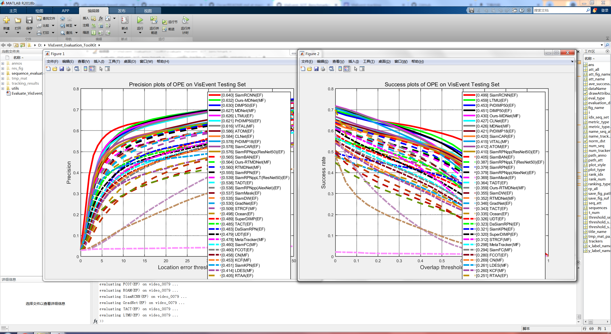

# VisEvent_SOT_Benchmark  
The First Large-scale Benchmark Dataset for Reliable Object Tracking by fusing RGB and Event Cameras. 

**VisEvent: Reliable Object Tracking via Collaboration of Frame and Event Flows**, Xiao Wang, Jianing Li, Lin Zhu, Zhipeng Zhang, Zhe Chen, Xin Li, Yaowei Wang, Yonghong Tian, Feng Wu **[[Paper](https://arxiv.org/pdf/2108.05015.pdf)] [[Project](https://sites.google.com/view/viseventtrack/)] [[DemoVideo](https://www.youtube.com/watch?v=U4uUjci9Gjc)]** 


## Introduction 
Different from visible cameras which record intensity images frame by frame, the biologically inspired event camera produces a stream of asynchronous and sparse events with much lower latency. In practice, the visible cameras can better perceive texture details and slow motion, while event cameras can be free from motion blurs and have a larger dynamic range which enables them to work well under fast motion and low illumination. Therefore, the two sensors can cooperate with each other to achieve more reliable object tracking. In this work, we propose a large-scale Visible-Event benchmark (termed VisEvent) due to the lack of a realistic and scaled dataset for this task. Our dataset consists of 820 video pairs captured under low illumination, high speed, and background clutter scenarios, and it is divided into a training and a testing subset, each of which contains 500 and 320 videos, respectively. Based on VisEvent, we transform the event flows into event images and construct more than 30 baseline methods by extending current single-modality trackers into dual-modality versions. More importantly, we further build a simple but effective tracking algorithm by proposing a cross-modality transformer, to achieve more effective feature fusion between visible and event data. Extensive experiments on the proposed VisEvent dataset, and two simulated datasets (i.e., OTB-DVS and VOT-DVS), validated the effectiveness of our model. 


## Dataset Samples 


## How to Download VisEvent Dataset? 
We provide both the original **aedat4** (contains the RGB frames, event, time-stamp) and **image** format for VisEvent dataset. 

**The "Image" only version (about 63.7GB):** 
Preview of each files:  
[[**BaiduYun (Code: pclt)**](https://pan.baidu.com/s/1E7dgAxHV2QFPByKs3is7nw)] [[**GoogleDrive**](https://drive.google.com/drive/folders/1o_hZmZGUbZspxsj2a32vHNL8WwiMJ_Sh?usp=sharing)] [[**OneDrive**](https://stuahueducn-my.sharepoint.com/:f:/g/personal/e16101002_stu_ahu_edu_cn/Em_Cv5OzNpBAjlhzOHeqwxEBDudLz4hNQU-gfuZqvRTT-g?e=25lMs9)] 


**The "aedat4" version:** 
Preview of each files:  
[[BaiduYun(Code: )]()] [[Googledrive]()] [[Onedrive]()]


## Baseline Methods
The source code of baseline trackers by fusing dual-modalities can be found at: [[RGB-DVS-SOT-Baselines](https://github.com/wangxiao5791509/RGB-DVS-SOT-Baselines)].


## How to load the aedat4 file? 
We provide a python script ([**read_aedat4.py**](https://github.com/wangxiao5791509/VisEvent_SOT_Benchmark/blob/main/scripts/read_aedat4.py)) to load the aedat4 file. Here is an example: 

1). Install the required toolkit [[**dv-gui**](https://inivation.gitlab.io/dv/dv-docs/docs/getting-started.html)]. Please use different scripts for various Ubuntu OS: 

**Ubuntu 20.04**:

    sudo add-apt-repository ppa:inivation-ppa/inivation
    sudo apt-get update
    sudo apt-get install dv-gui

**Ubuntu 18.04**: 

    sudo add-apt-repository ppa:ubuntu-toolchain-r/test
    sudo add-apt-repository ppa:inivation-ppa/inivation-bionic
    sudo apt-get update
    sudo apt-get install dv-gui

**Ubuntu 16.04**: 

    sudo add-apt-repository ppa:ubuntu-toolchain-r/test 
    sudo add-apt-repository ppa:lkoppel/opencv 
    sudo add-apt-repository ppa:janisozaur/cmake-update 
    sudo add-apt-repository ppa:inivation-ppa/inivation-xenial 
    sudo apt-get update 
    sudo apt-get install dv-gui

Other softwares:

    pip install opencv-python numpy pillow -i https://pypi.tuna.tsinghua.edu.cn/simple 


2). Open your terminal and run the script: 

    python read_aedat4.py


## Evaluation ToolKit 
Only matlab version is available. 

**1. Download this github:**
    
    git clone https://github.com/wangxiao5791509/VisEvent_SOT_Benchmark

**2. Download the tracking results of our benchmark:**
[[**GoogleDrive (181.5MB)**](https://drive.google.com/file/d/1slfxEOtmSAQFRv_OmDeeoiiK1F-DqhEz/view?usp=sharing)]

    unzip tracking_results_VisEvent_SOT_benchmark.zip, and put it into the folder "tracking_results". 

    unzip the "annos.zip" in the folder "annos"

**3. Open your matlab, and run the script "Evaluate_VisEvent_SOT_benchmark.m". Wait and check the final evaluated figures**

 


## More Related Materials 
* [**Github-1**] https://github.com/wangxiao5791509/SNN_CV_Applications_Resources 
* [**Github-2**] https://github.com/uzh-rpg/event-based_vision_resources 
* [**Github-3**] https://github.com/wangxiao5791509/Single_Object_Tracking_Paper_List
* [**Survey**] **神经形态视觉传感器的研究进展及应用综述**，计算机学报，李家宁, 田永鸿 [[Paper](https://drive.google.com/file/d/1d7igUbIrEWxmUI7xq75P6h_I4H7uI3FA/view?usp=sharing)] 
* [**Survey**] **Event-based Vision: A Survey**, Guillermo Gallego, et al., IEEE T-PAMI 2020, [[Paper](https://arxiv.org/abs/1904.08405)]
* [**FE108 dataset**] **Object Tracking by Jointly Exploiting Frame and Event Domain**, Jiqing Zhang, et al., ICCV 2021, [[Project](https://zhangjiqing.com/dataset/)] [[DemoVideo](https://www.youtube.com/watch?v=EeMRO8XVv04&ab_channel=JiqingZhang)] 


## Citation: 
If you find this work useful for your research, please cite the following papers: 

```bibtex
@article{wang2021viseventbenchmark,
  title={VisEvent: Reliable Object Tracking via Collaboration of Frame and Event Flows},
  author={Xiao Wang, Jianing Li, Lin Zhu, Zhipeng Zhang, Zhe Chen, Xin Li, Yaowei Wang, Yonghong Tian, Feng Wu},
  journal={arXiv:2108.05015},
  year={2021}
}
```

If you have any questions about this work, please submit an issue or contact me via wangxiaocvpr@foxmail.com. Thanks for your attention! 


